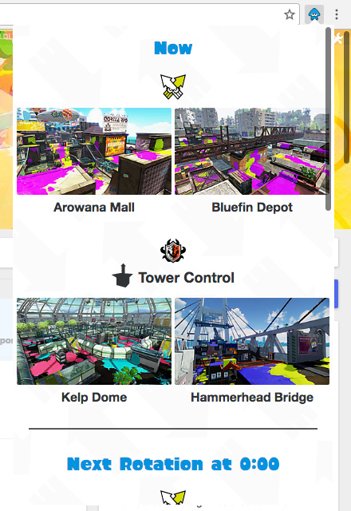

# Splat Rotations

A Chrome/Firefox extension fetching the current and upcoming Splatoon stages.

<table align="center">
	<tr>
		<td></td>
		<td></td>
	</tr>
</table>

## How to install

* **Chrome:** 
  Install from the [Chrome Web Store](https://chrome.google.com/webstore/detail/splat-rotations/gafbbdopihfgddkhojbjfhdbckfkelka)

* **Firefox:** 
  Install from [soon](https://addons.mozilla.org).

* **Opera:** 
  Download the [Download Chrome extension](https://addons.opera.com/fr/extensions/details/download-chrome-extension-9/?display=en) then download the extension from the [Chrome Web Store](https://chrome.google.com/webstore/detail/splat-rotations/gafbbdopihfgddkhojbjfhdbckfkelka).
  It does not update itself so make sure to check manually every once and a while.

* **Safari:** 
  In June 2015, Apple announced the merging of their developer plans. [Developing for Safari was free before](http://gizmodo.com/apples-great-new-developer-program-screws-over-safari-d-1710539882), but as of now it cost 99$/y. Splat Rotations was initially planned for Safari, but I will not pay that much money to develop a free browser extension. **So, no support for Safari is planned.** If you are a developer with access to the Apple Developer Program, you can fork my project and port the code.

## The extension is not translated in my language

English, German, Spanish and French are fully supported. You can also help [translate the extension](https://poeditor.com/join/project/pwVRLVIrEt) in your language.

## I found a bug!
Nice! Feel free to [create a new issue](https://github.com/jfgoncalves/splat-rotations/issues) so I can fix it asap.

## I want to contribute. What can I do?
The extension currently needs:

* [Full translations](https://poeditor.com/join/project/pwVRLVIrEt) in:
	* Italian
	* Japanese

##Disclaimer
Splatoon and all other official names © 1995-2015 Nintendo.  Most images used within the extension are official images released by and © Nintendo. Any of the trademarks, service marks, collective marks, design rights, personality rights or similar rights that are mentioned, used or cited in this program are the property of their respective owners.  Splat Rotations is the work of a fan and is no way affiliated with Nintendo, or any of their partners. No copyright infringement intended.
